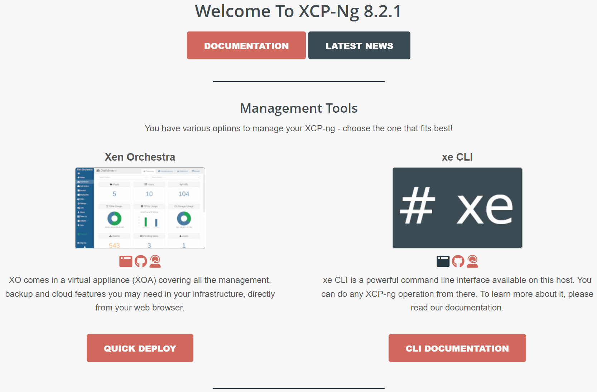
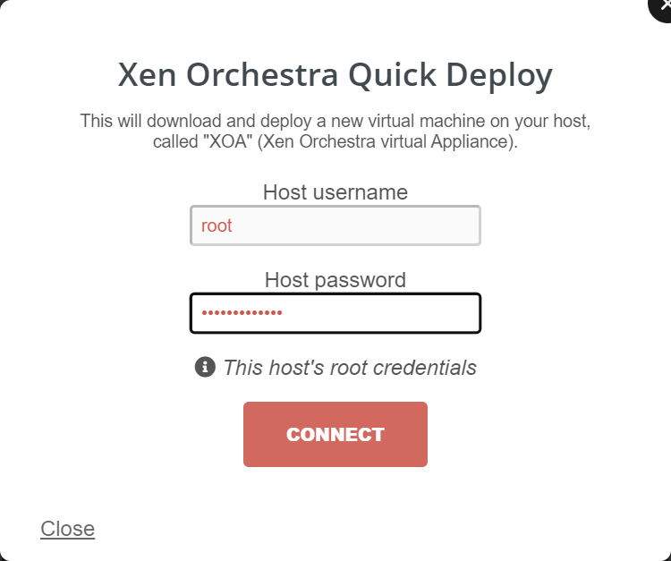
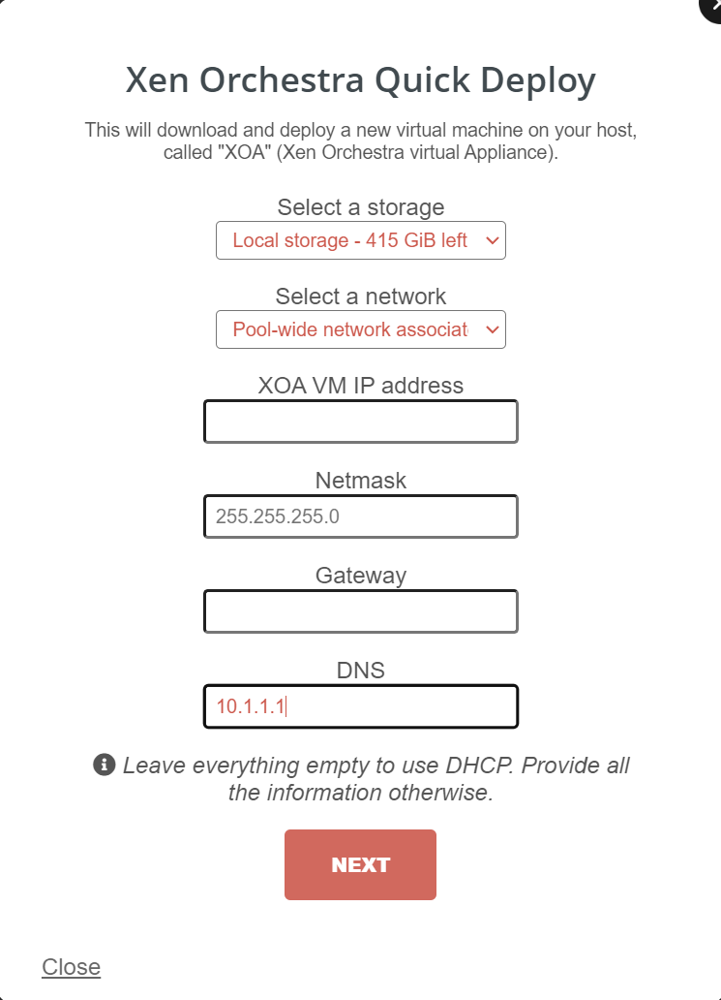
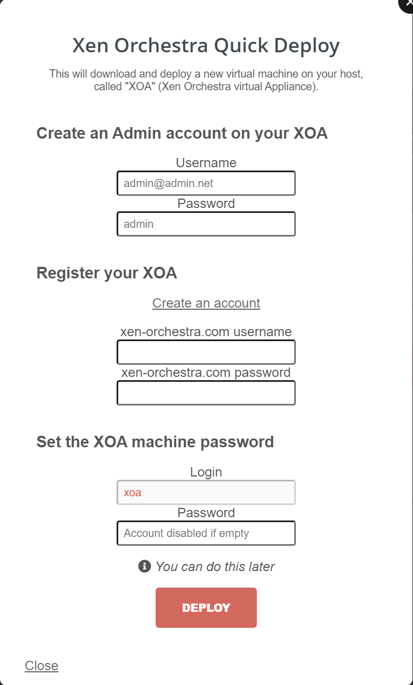

Deploying XOA the first time is very easy.
Grab the IP of your xcp-ng host, and visit `https://<xpc.ng.host.ip>`

You will see a webpage like below

- Click <kbd>Quick Deploy</kbd>
- Type the root password you entered while installing xcp-ng
- Click <kbd>Connect</kbd>

  

- Leave everything empty if you want to use DHCP.
- Click <kbd>Next</kbd>

  

- Leave everything empty and change password later

or

- Create XOA Admin Account now
- Click <kbd>Deploy</kbd>

  

It will take a while to deploy XOA VM, depending on your hardware.
Once it's done it will redirect you to XOA's web login

Default Username/Password is:

Username: `admin@admin.net`
Password: `admin`

- Follow the [Quick Start](../setup-xoa.md) guide
