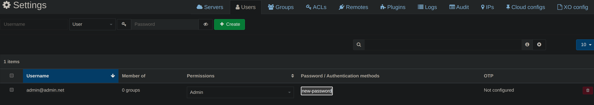

:::note Prerequisites

- [XOA installed](./install-xoa)

:::

After you login

## Change default password

Navigate to `Settings` > `Users`

- Click on the username to edit it
- Click on `Click to edit` on the same user
- Enter your new password
- Press <kbd>Enter</kbd> to save
- Logout and login again with your new password

  

## Add server

- Click <kbd>☁️Add server</kbd>.

  

- Fill your xcp-ng host's info
- Don't forget to toggle the `Allow Unauthorized Certificates` button, unless you used valid certificates
- Click <kbd>💾Connect</kbd>

  

- Go to `🏠Home` > `Hosts`
- Long click on `Default install` and add a description
  This is mostly for your own reference

  
