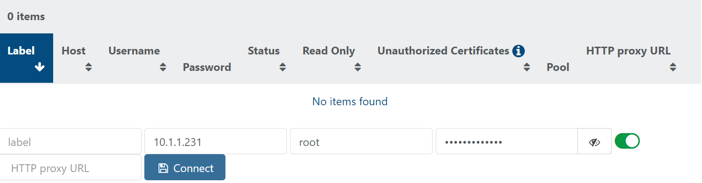

:::note Prerequisites

- [XOA installed](./install-xoa)

:::

## Add server

After you login

- Click <kbd>☁️Add server</kbd>.

  

- Fill your xcp-ng host's info
- Don't forget to toggle the `Allow Unauthorized Certificates` button, unless you used valid certificates

  

- Click <kbd>💾Connect</kbd>

  
