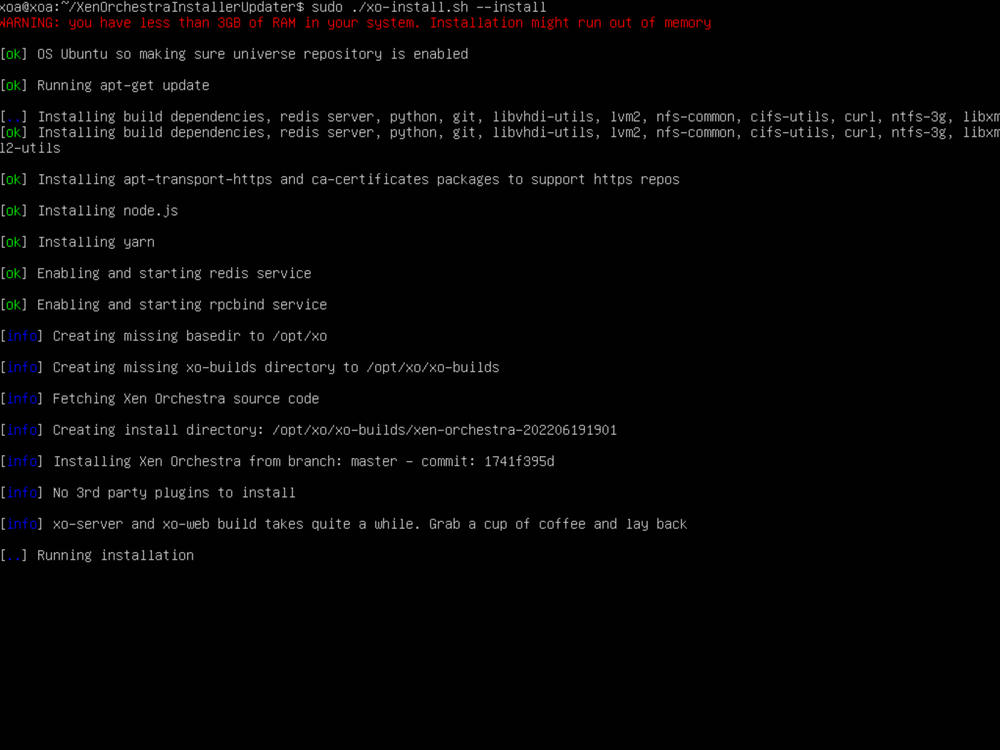
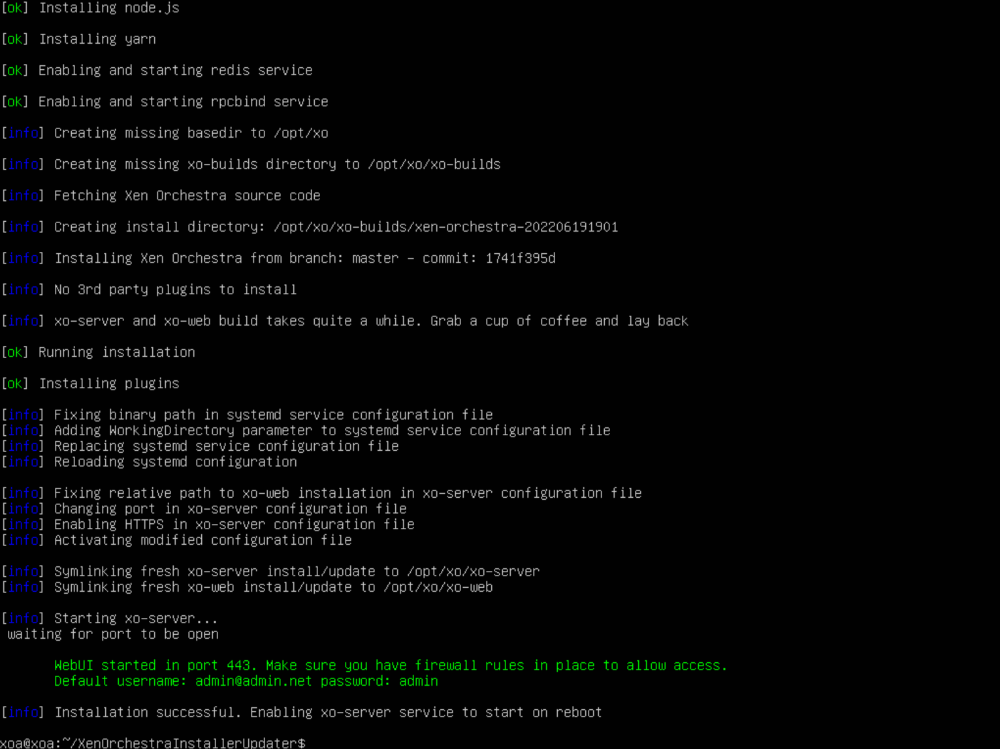

You can choose between 3 Methods to install XOA.

- **Quick Deploy**, which spins a VM with limited available features
- **Fast/Easy**, which downloads a pre-created VM that is build from source code and includes all features
- **From source**, which you manually download and install the OS and then run the installer to build XOA, this also includes all features

## Xen Orchestra Appliance (Quick Deploy)

Deploying XOA the first time is very easy.
Grab the IP of your xcp-ng host, and visit `https://<xpc.ng.host.ip>`

You will see a webpage like below


- Click <kbd>Quick Deploy</kbd>
- Type the root password you entered while installing xcp-ng
- Click <kbd>Connect</kbd>


- Leave everything empty if you want to use DHCP.
- Click <kbd>Next</kbd>


- Leave everything empty and change password later

or

- Create XOA Admin Account now
- Click <kbd>Deploy</kbd>


It will take a while to deploy XOA VM, depending on your hardware.
Once it's done it will redirect you to XOA's web login

Default Username/Password is:

Username: `admin@admin.net`
Password: `admin`

## XOA VM Import (Fast/Easy)

- SSH to your `xcp-ng` host
- Run the following command

  ```shell
  sudo bash -c "$(curl -s https://raw.githubusercontent.com/ronivay/XenOrchestraInstallerUpdater/master/xo-vm-import.sh)"
  ```

- Follow the on-screen instructions
- Visit `https://<ip.you-entered-on.setup>`

- Done

You might want to make this VM auto start when xcp-ng host boots.
Also protect from accidental deletion or shutdown.

Navigate to `🏠Home` > `🖥️VMs`

- Click `xo-ce`
- Click `Advanced`
- Toggle on `Auto power on`
- Toggle on `Protect from accidental deletion`
- Toggle on `Protect from accidental shutdown`


## XOA (From source)

Installing XOA from source gives you all the pro features available.

### Install Ubuntu VM

Follow the guide [here](./2-install-ubuntu-vm.md)

### Build XOA from source

For this method, to make it easier, follow first the `Quick Deploy` method, then come back here.

Navigate to `🏠Home` > `🖥️VMs`

- Click the `XOA` VM (with descriptions `XOA from Source`)
- Navigate to `Console`
- Run the following:

```shell
# Install git
sudo apt update
sudo apt install git

# Clone the XOA Installer
git clone https://github.com/ronivay/XenOrchestraInstallerUpdater.git
cd XenOrchestraInstallerUpdater/

# Copy example config to a new file named xo-install.cfg
cp sample.xo-install.cfg xo-install.cfg

# Edit the config file (below you will find my sample)
nano xo-install.cfg

# Run the installation script (This will take a while)
sudo ./xo-install.sh --install
```





After the installer is finished, visit `https://<the.ip.ofyour.vm>`

Default credentials are:

- Username: `admin@admin.net`
- Password: `admin`

Now you are ready for the next step `Add server`

> This is how my xo-install.cfg looks like.
> With this setup it will auto generate self signed certs and run on https

```shell
# Optional user that runs the service
# default: root
# no effect to Xen Orchestra proxy
#XOUSER=

# Optional parameter if running as non privileged user to use sudo when mounting/umounting shares inside Xen Orchestra
# no effect if XOUSER is root
# options true/false
# no effect to Xen Orchestra proxy
#USESUDO=false

# Optional parameter to generate sudoers config when missing completely if USESUDO is set to true
# no effect if XOUSER is root
# options true/false
# no effect to Xen Orchestra proxy
#GENSUDO=false

# Port number where xen-orchestra service is bound
# no effect to Xen Orchestra proxy
PORT="443"

# Base dir for installation and future updates
INSTALLDIR="/opt/xo"

# Script will update itself if there's a newer version available. This assumes that script inside a git directory and
# remote is ronivay/XenOrchestraInstallerUpdater
# options: true/false
SELFUPGRADE=true

# Xen Orchestra configuration file is stored in XOUSER's home directory ($HOME/.config/xo-server/config.toml) and
# by default will be overwritten with every update done by this script.
# You may disable this if you edit configuration by hand and don't want an update to overwrite it.
# Note that some of the options defined here won't be applied even if changed if this is set to false.
# options: true/false
# no effect to Xen Orchestra proxy
CONFIGUPDATE=true

# Location of Xen Orchestra repository where source code is fetched
REPOSITORY="https://github.com/vatesfr/xen-orchestra"

# Git branch, tag (append tags/ before the tag name) or individual commit where xen-orchestra sources are fetched.
BRANCH="master"

# Installation log path
# default: ./logs
#LOGPATH=

# Only one PLUGINS variable can be used at a time. Comment out the other one if you change these below.
# Comment out both if you don't want any plugins to be installed.

# Comma separated list of plugins to be installed, check README for more information. Note that 3rd party plugins
# defined below should be listed here as well with their name eq. repo1,repo2 etc.
#PLUGINS="xo-server-transport-email,xo-server-usage-report,xo-server-perf-alert"

# (default) all plugins will be installed, including possible 3rd-party plugins if defined.
PLUGINS="all"

# Additional 3rd-party plugins to fetch. Keep the .git suffix.
#ADDITIONAL_PLUGINS="https://github.com/user/repo.git,https://github.com/user/repo2.git"

# NodeJS and Yarn are automatically updated when running update/install. Can be disabled but not recommended
# (installation might fail because of too old node.js or yarn)
# Note that if nodejs is updated when script's update feature is used, it might not be possible to use rollback option
# anymore without manually downgrading nodejs version to previous one
# options: true/false
AUTOUPDATE="true"

# enable/disable OS check. Installation refuses to run on any other than supported OS versions if this is enabled.
# Can be disabled for experimental purposes.
# options: true/false
OS_CHECK="true"

# enable/disable architecture check. Installation refuses to run on any other than x86_64 if enabled.
# Can be disabled for experimental purposes.
# options: true/false
ARCH_CHECK="true"

# Define the number of previous successful installations you want to keep. Needs to be at least 1.
# Determines how far the rollback feature can be used.
PRESERVE="3"

# certificate settings have no effect to Xen Orchestra proxy, it'll generate it's own self-signed certificates always

# Location of pem certificate/key files. Installation will automatically configure HTTPS if these are defined.
# Remember to change PORT variable as well.
PATH_TO_HTTPS_CERT=$INSTALLDIR/xo.crt
PATH_TO_HTTPS_KEY=$INSTALLDIR/xo.key

# location of CA certificate file.
# define this if your host certificate is issued by a custom CA and you want XO to trust it.
# file can contain multiple certificates
#PATH_TO_HOST_CA=

# If set to true together with cert/key paths, defined pem key/certificate will be created if neither exists.
# options: true/false
AUTOCERT="true"

# If set to true, this will install the rpm/deb repositories necessary for the Xen Orchestra install.
# If set to false, these repositories will not be installed. Also automatic nodejs upgrade will be disabled.
# Note that installation will fail if all needed packages aren't available from configured repositories.
# See README for list of packages.
# options: true/false
# default: true
#INSTALL_REPOS="true"
```

## Add server

After you login

- Click <kbd>☁️Add server</kbd>.

- Fill your xcp-ng host's info
- Don't forget to toggle the `Allow Unauthorized Certificates` button, unless you used valid certificates

- Click <kbd>💾Connect</kbd>


## Cleanup

This step is only needed if you followed the `XOA (From source)` method

Navigate to `🏠Home` > `🖥️VMs`

- Click `XOA` (The one with description of `Xen Orchestra virtual Appliance`)
- Click `Advanced`
- Click <kbd>Force shutdown</kbd>
- Click <kbd>Remove</kbd>
