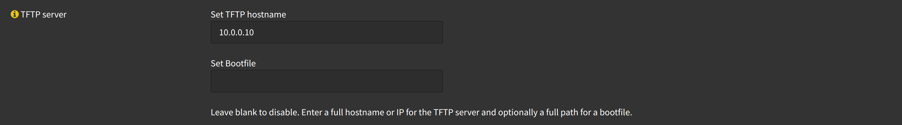
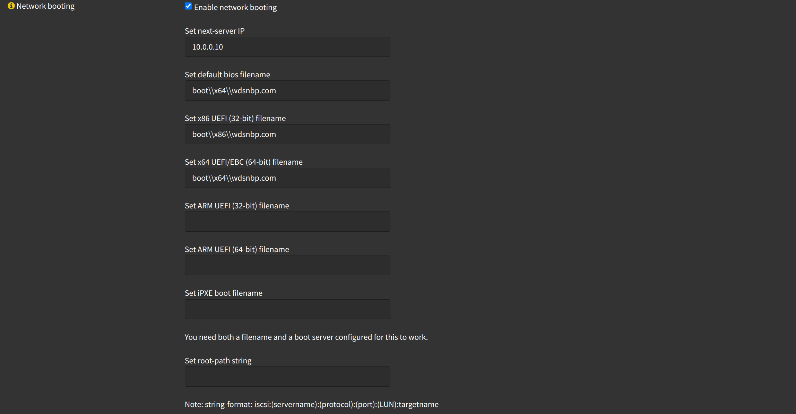
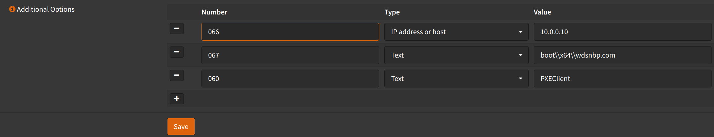
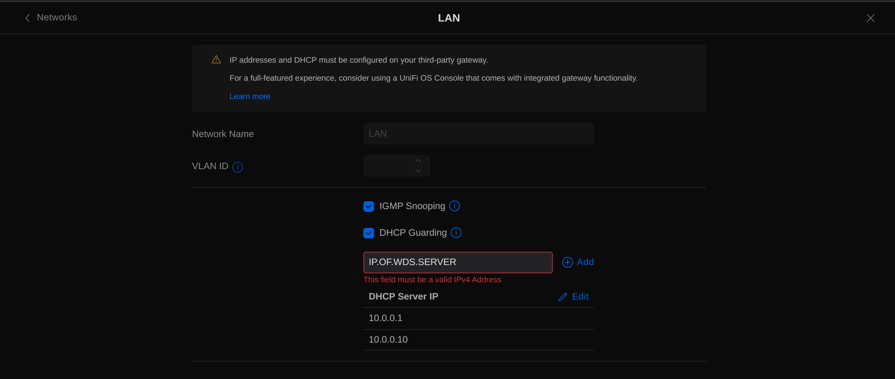

If you have a [WDS](https://docs.microsoft.com/en-us/windows/win32/wds/windows-deployment-services-portal)
on your network you might notice that VLANs or networks not in the same range (sometimes in the same range also)
as your WDS server, might not be able to detect it for booting.

You can fix that by doing some configuration on your DHCP server for that VLAN/Network.

## OPNsense DHCP

Navigate to `Services` -> `DHCPv4` -> `[YOUR INTERFACE]`

Under `TFTP Server`

- Click <kbd>Advanced</kbd>
- TFTP Server: `IP.OF.WDS.SERVER`

Under `Network Booting`

- Click <kbd>Advanced</kbd>
- Next Server: `IP.OF.WDS.SERVER`
- Default BIOS file name: `boot\\x64\\wdsnbp.com`
- UEFI 86 bit file name: `boot\\x86\\wdsnbp.com`
- UEFI 64 bit file name: `boot\\x64\\wdsnbp.com`

Under `Additional Options`

- Click <kbd>Advanced</kbd>
- Click <kbd>➕</kbd>
  - Number: `066`
  - Type: `IP address or host`
  - Value: `IP.OF.WDS.SERVER`
- Click <kbd>➕</kbd>
  - Number: `067`
  - Type: `Text`
  - Value: `boot\\x64\\wdsnbp.com`
- Click <kbd>➕</kbd>
  - Number: `060`
  - Type: `Text`
  - Value: `PXEClient`

Click <kbd>Save</kbd>

:::tip

If you have UniFi switches, make sure you have added your WDS
server to the DHCP Guarding trusted list, for each network.

:::

## UniFi DHCP Guarding

Navigate to `Settings` -> `Networks` -> `[YOUR NETWORK]` -> `DHCP Guarding`

- Add your WDS server to the trusted list
- Click <kbd>Add</kbd>
- Click <kbd>Apply Changes</kbd>

