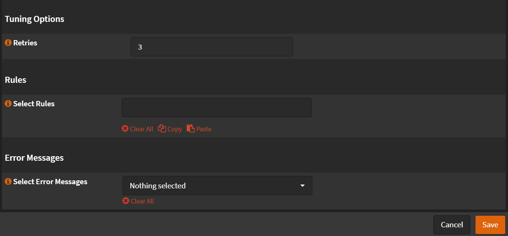
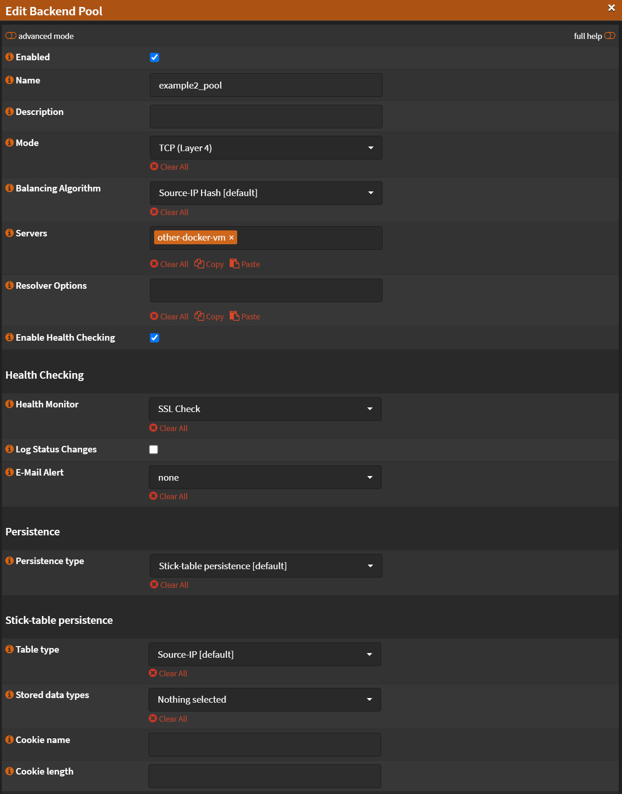
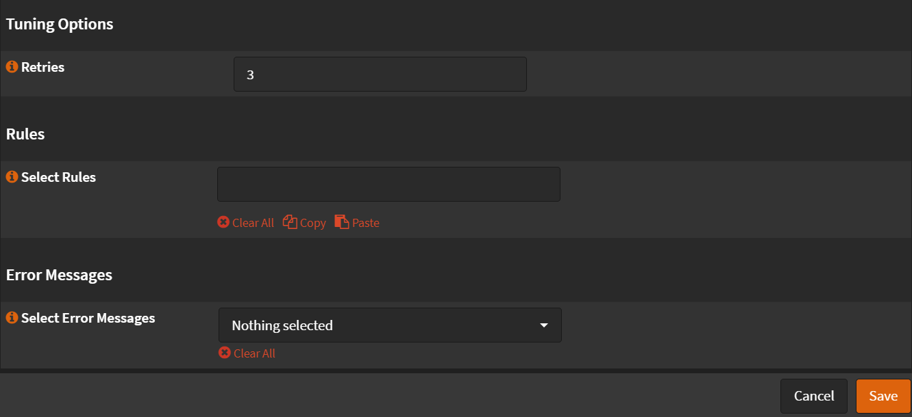
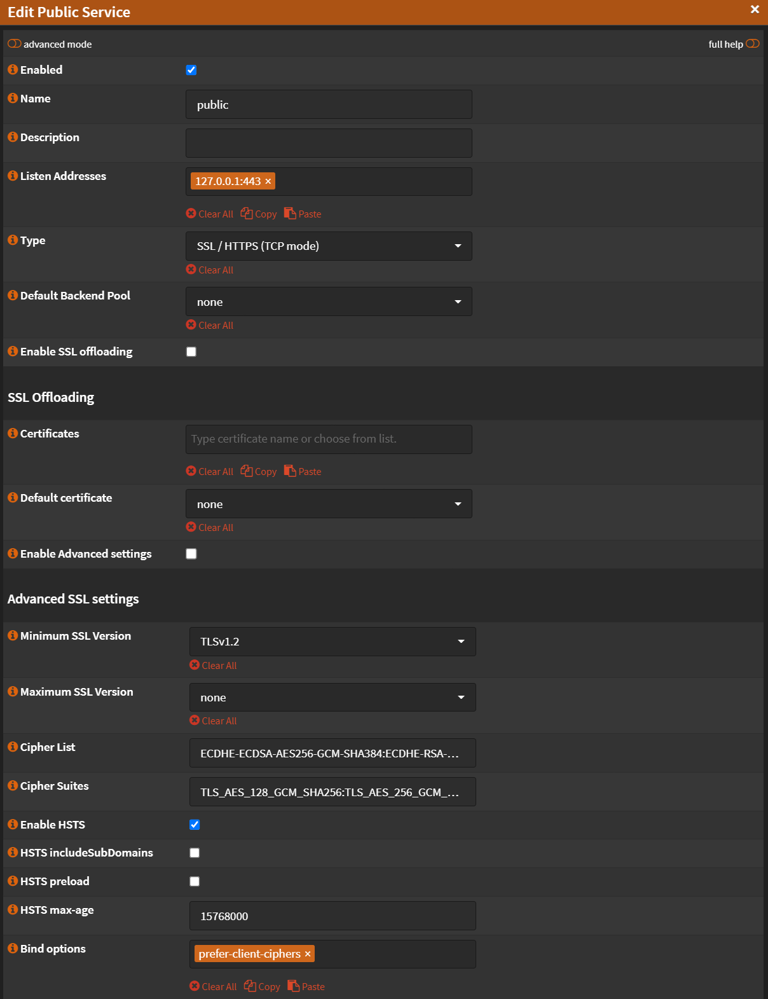

Navigate to `Services` -> `HAProxy` -> `Settings`

- Click <kbd>🔽</kbd> next to `Virtual Services`

## Backend Pools

- Click `Backend Pools`

### Backend Pool 1

- Click <kbd>➕</kbd>
- Check `Enabled`
- Name: `example1_pool`
- Mode: `TCP (Layer4)`
- [Servers](real-servers.md#server-1): `docker-vm`
- Check `Enable Health Checking`
- [Health Monitor](rules-checks.md#health-monitors): `SSL Check`
- Retries: `3`

- Click <kbd>Save</kbd>
- Click <kbd>Apply</kbd>

### Backend Pool 2

- Click <kbd>➕</kbd>
- Check `Enabled`
- Name: `example1_pool`
- Mode: `TCP (Layer4)`
- [Servers](real-servers.md#server-2): `other-docker-vm`
- Check `Enable Health Checking`
- [Health Monitor](rules-checks.md#health-monitors): `SSL Check`
- Retries: `3`

- Click <kbd>Save</kbd>
- Click <kbd>Apply</kbd>

## Public Services

- Click `Public Services`

### Frontend

- Click <kbd>➕</kbd>
- Name: `public`
- Listen Addresses: `127.0.0.1:443`
- Type: `SSL/HTTPS (TCP Mode)`
- Default Backend Pool: `none`
- Uncheck `Enable SSL offloading`
- [Select Rules](rules-checks.md#rules):
  - `Accept Content if Contains SSL Hello`
  - `TCP Inspect Delay`
  - `rule-example1_com`
  - `rule-example2_com`

:::note

Order on rules matter!

:::

- Click <kbd>Save</kbd>
- Click <kbd>Apply</kbd>
