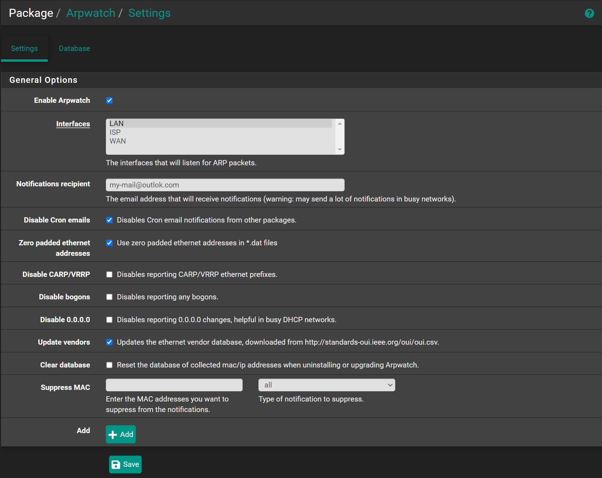
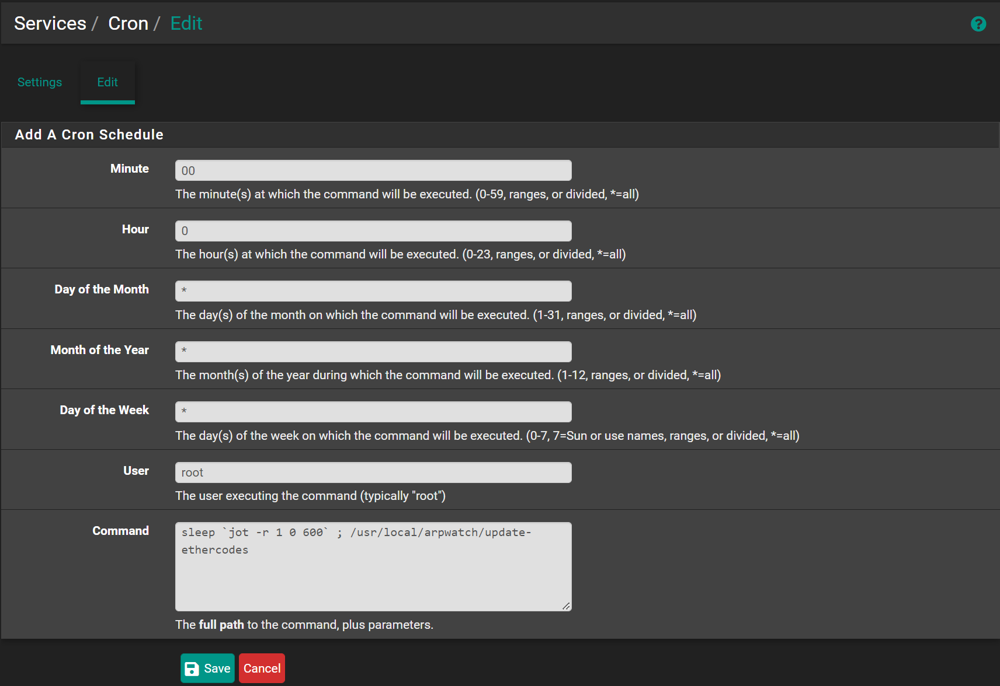

## Configure Cron

Navigate to `Services` -> `Cron`

- Click <kbd>➕Add</kbd>
- Minute: `00`
- Hour: `0`
- Day of the Month: `*`
- Month of the Year: `*`
- Day of the Week:`*`
- User: `root`
- Command: ``sleep `jot -r 1 0 600` ; /usr/local/arpwatch/update-ethercodes``
- Click <kbd>💾Save</kbd>

## Configure ArpWatch

Navigate to `Services` -> `Arpwatch`

- Check `Enable Arpwatch`
- Interfaces: `Select interfaces you want to monitor` (Hold <kbd>CTRL</kbd> to select multiple)
- Notifications recipient: `my-mail@outlook.com` (The mail to receive the notifications)
- Click <kbd>💾Save</kbd>

