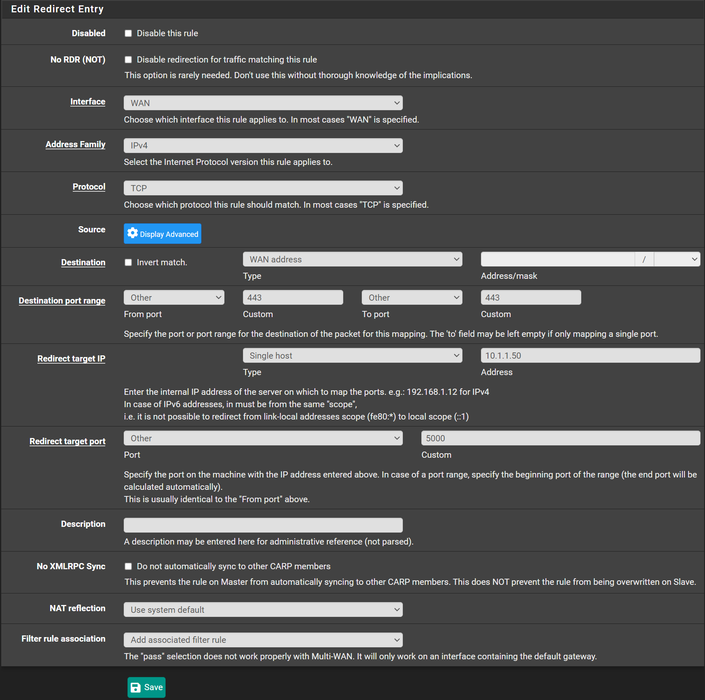
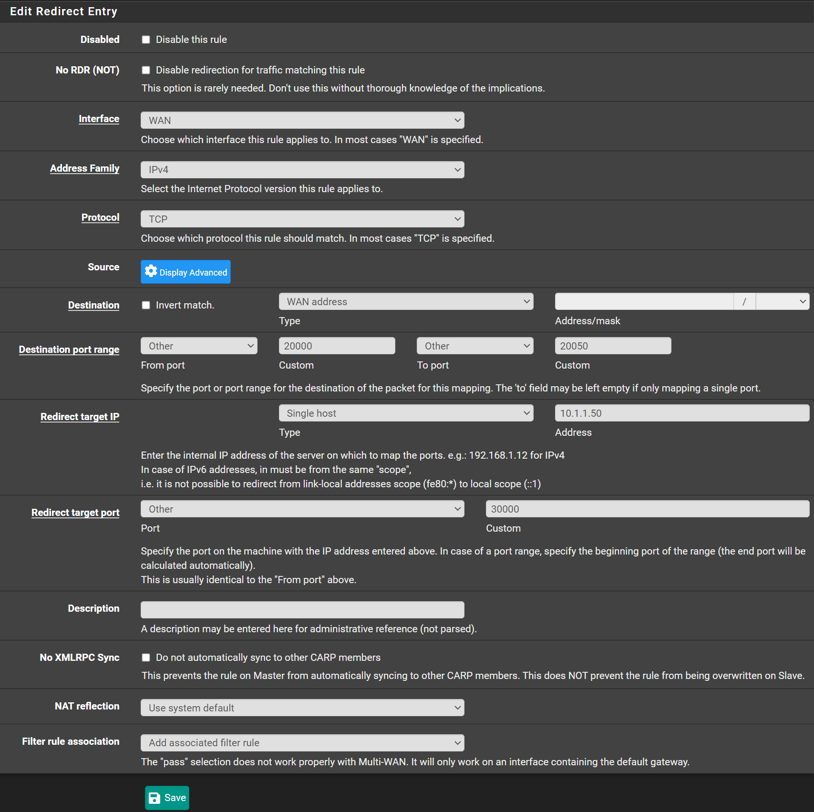

We will forward a port from pfSense's external IP to an internal IP.
For example if you want to expose a web service on port 443 on your external IP
and internal server is running on port 5000.

Navigate to `Firewall` -> `NAT` -> `Port Forward`

- Click <kbd>⤵️Add</kbd>
- Interface: `WAN`
- Address Family: `IPv4`
- Protocol: `TCP` (Change this depending on your use case)
- Destination: `WAN address`
- Destination port range:
  - From port: `443`
  - To port: `443`
- Redirect Target IP: `10.1.1.50` (Change this to your internal's server IP address)
- Redirect target port: `5000`
- Click <kbd>💾Save</kbd>

Or if you want to expose a range of ports...
eg External `20000`-`20050` to Internal `30000`-`30050`

- Click <kbd>⤵️Add</kbd>
- Interface: `WAN`
- Address Family: `IPv4`
- Protocol: `TCP` (Change this depending on your use case)
- Destination: `WAN address`
- Destination port range:
  - From port: `20000`
  - To port: `20050`
- Redirect Target IP: `10.1.1.50` (Change this to your internal's server IP address)
- Redirect target port: `30000` (You only specify the starting port here)
- Click <kbd>💾Save</kbd>

