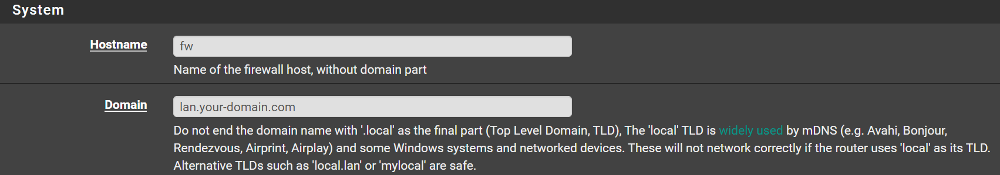
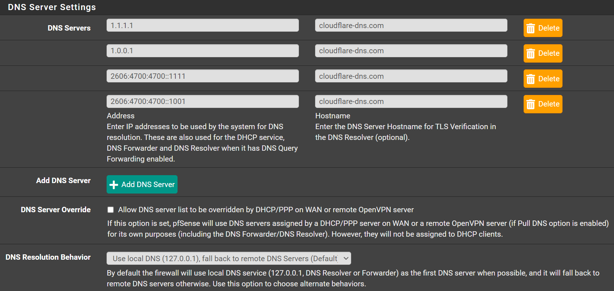
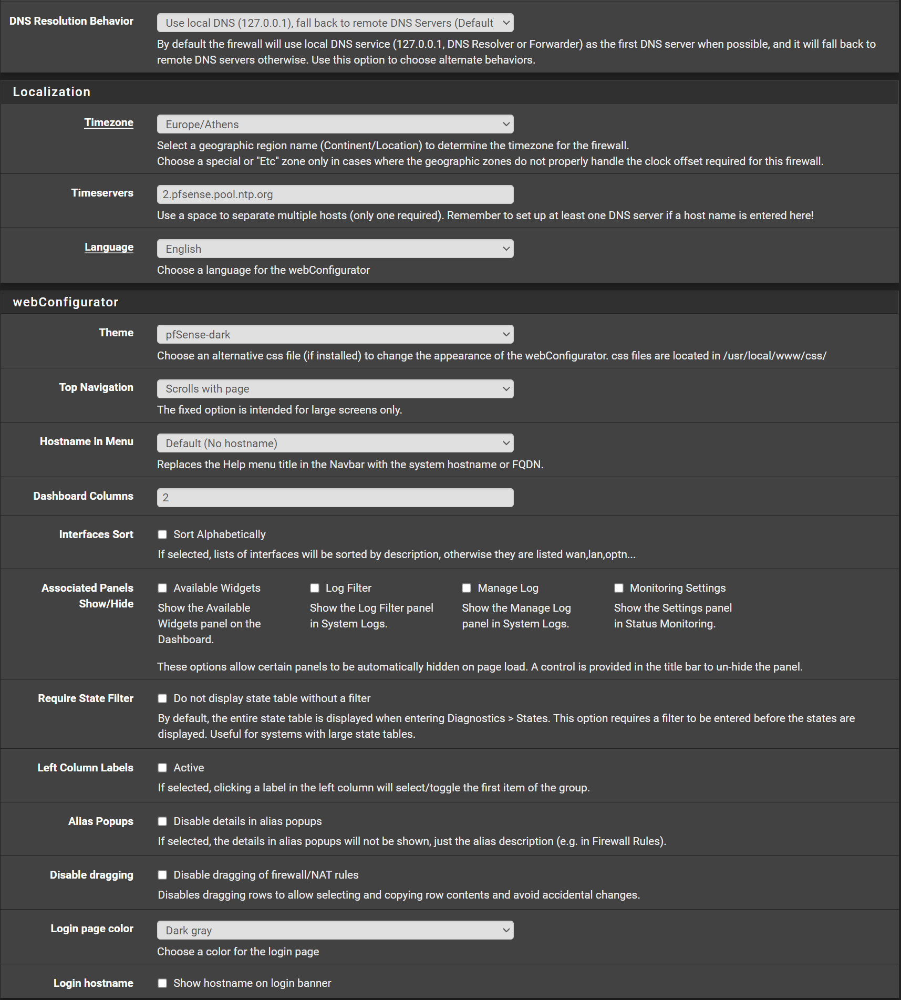

## System

- Hostname: `pfsense` (I like to use `fw`)
- Domain: `lan.your-domain.com` (or `home.your-domain.com`)

## DNS Server Settings

Navigate to `System` -> `General Setup`

- Click <kbd>➕Add DNS Server</kbd>
- Click <kbd>➕Add DNS Server</kbd>
- Set DNS Servers:
  - DNS Server: `1.1.1.1` - DNS Host: `cloudflare-dns.com`
  - DNS Server: `1.0.0.1` - DNS Host: `cloudflare-dns.com`
  - DNS Server: `2606:4700:4700::1111` - DNS Host: `cloudflare-dns.com`
  - DNS Server: `2606:4700:4700::1001` - DNS Host: `cloudflare-dns.com`
- Uncheck `DNS Server Override`
- DNS Resolution Behavior: `Use local DNS (127.0.0.1), fall back to remote DNS Servers`
- Click <kbd>💾Save</kbd>

## webConfiguurator

Navigate to `System` > `General Setup`

Scroll to `webConfigurator`

Change `Theme` to your prefered color. I prefer `pfSense-dark`
You can also change `Login page color` to your prefered color. I prefer again `pfSense-dark`

