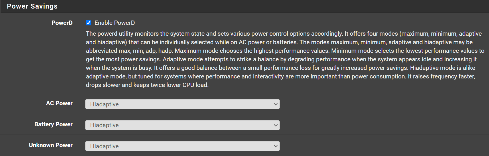
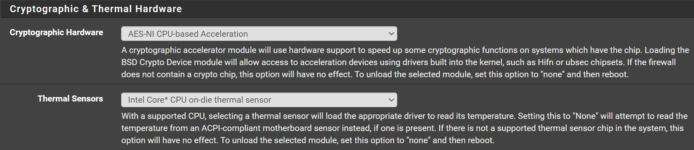

There are few settings you can enable,

- Power Savings
- Hardware acceleration for cryptographic operations, such as VPN
- Thermal Sensors

Some of the above highly depend on your hardware (mainly the CPU)

## Power Savings

Navigate to  `System` -> `Advanced` -> `Miscellaneous`

You can also enabled power savings feature, and configure how it works when it's plugged in or on batteries.

- Check `Enable PowerD`
- AC Power: `Select the profile you want`
- Battery Power: `Select the profile you want`
- Unknown Power: `Select the profile you want`

Usually `hiadaptive` is a good choice

## Cryptographic & Thermal Hardware

Navigate to  `System` -> `Advanced` -> `Miscellaneous`
For `Intel` chips the below show work fine.

- Cryptographic Hardware: `AES-NI CPU-based Acceleration`
- Thermal Sensors: `Intel Core* CPU on-die thermal sensor`

