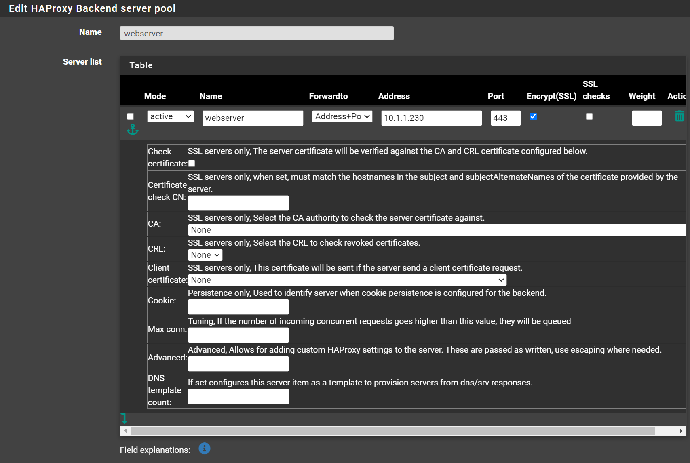
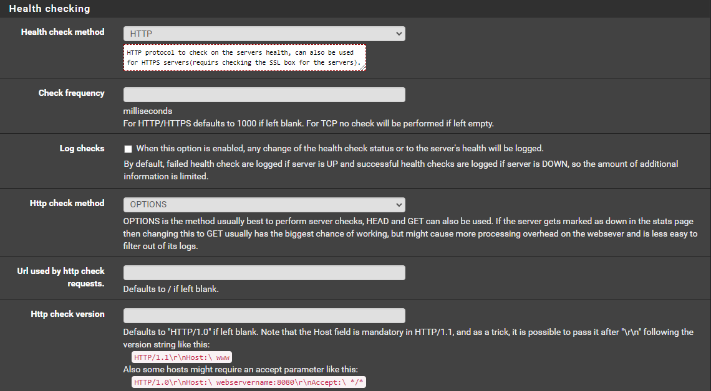
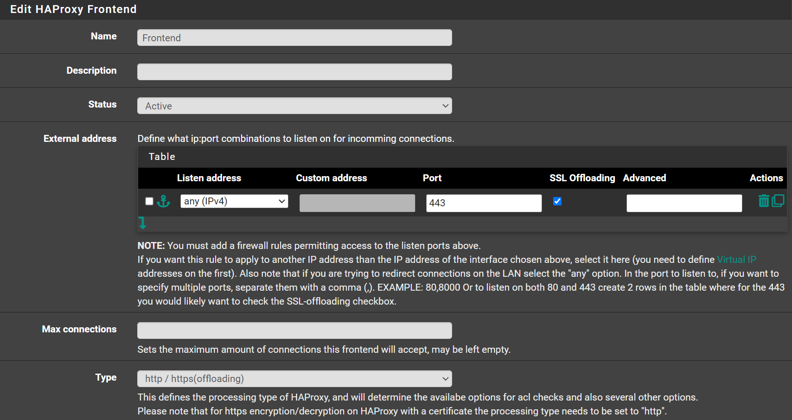
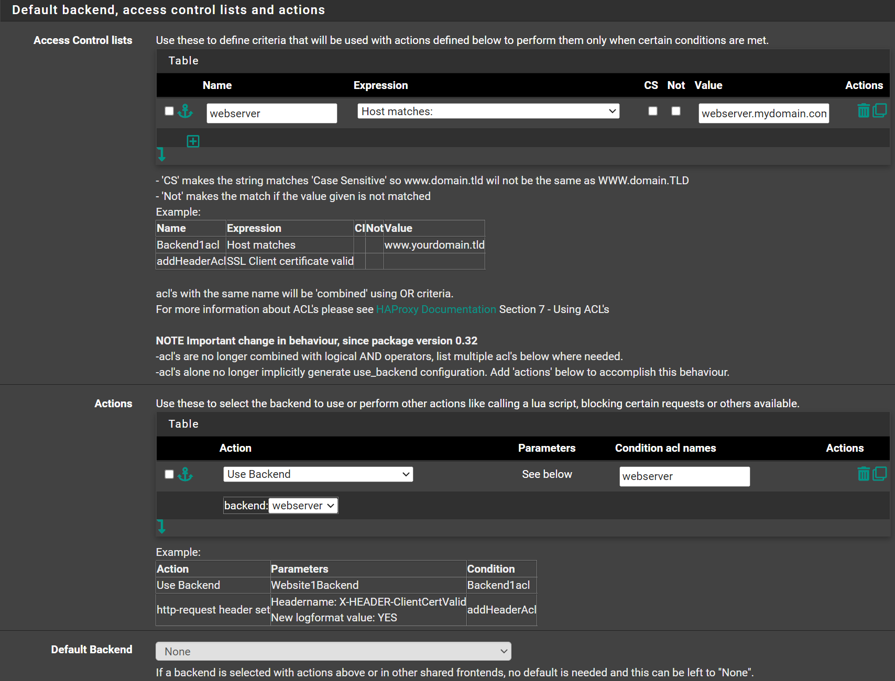
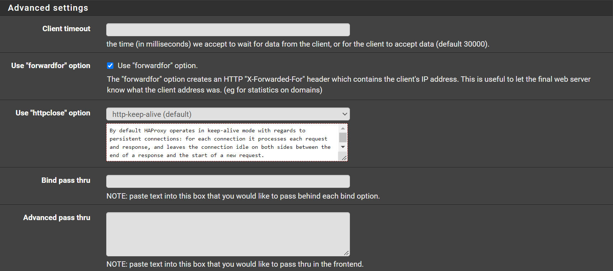
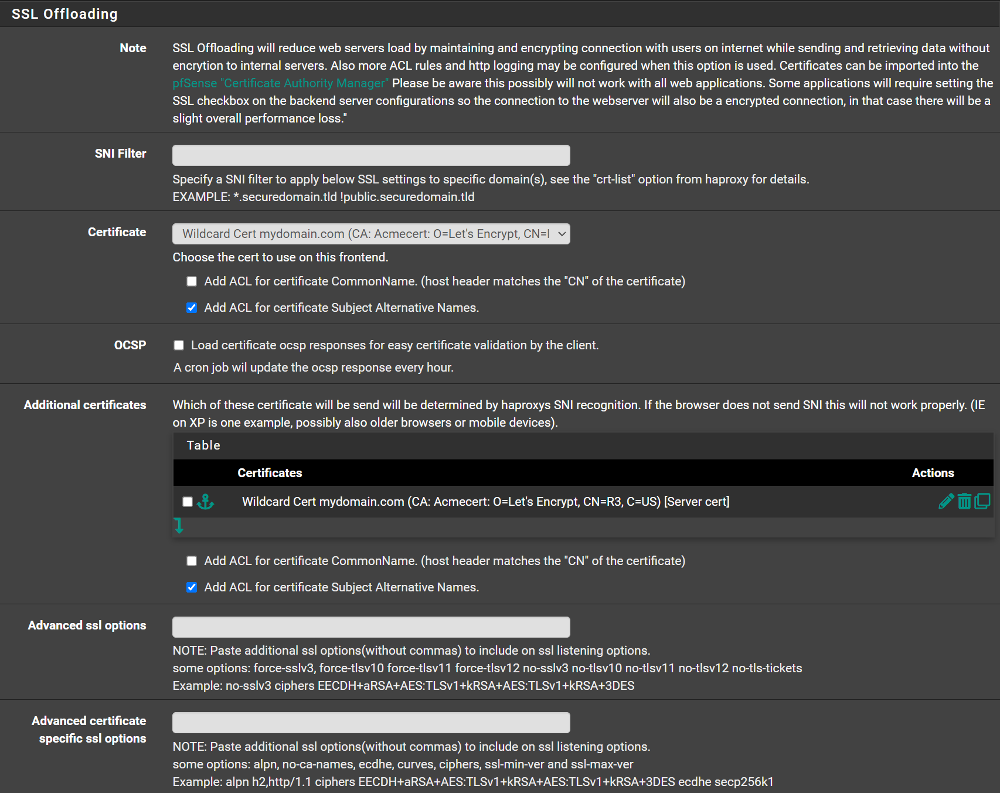

## Overview

We will use HAProxy for SSL/TLS Offloading

## Backend

Navigate to `Services` -> `HAProxy` -> `Backends` -> `Add`

- Name your backend (eg. `webserver`)
- Click ⤵️ on Server List
  - Name: `webserver`
  - Address: `10.1.1.230` (Put your webserver IP or hostname)
  - Port: `443` (Or the port your webserver is using)
  - Encrypt(SSL): `Checked` (Unchecked if your webserver does not use https)
  - SSL Checks: `Unchecked`
- Health checking
  - Health check method: `HTTP`
  - HTTP check method: `OPTIONS`
- Click <kbd>💾Save</kbd>
- Click <kbd>✔️Apply Changes</kbd>

## Frontend

Navigate to `Services` -> `HAProxy` -> `Frontends` -> `Add`

- Name your frontend (eg. `Frontend`)
- External Address
  - Listen Address: `any(IPv4)`
  - Port: `443`
  - SSL Offloading: `Checked`
- Type: `http/https (offloading)`
- Access Control lists
  - Click <kbd>⤵️</kbd>
  - Name:`webserver` (Pick any name you want)
  - Expression: `Host matches:`
  - CS: `Unchecked`
  - Not: `Unchecked`
  - Value: `webserver.mydomain.com` (put your domain here)
- Actions
  - Click <kbd>⤵️</kbd>
  - Action: `Use Backend`
  - Condition acl names: `webserver` (Use the exact name of one of the ACL's)
  - backend: `webserver` (Select the backend to redirect when the ACL matches)
- Stats options
  - Enable collection & providing separate statistics for each socket: `Checked`
- Advanced Settings
  - Use "forwardfor" option: `Checked`
- SSL Offloading
  - Certificate: (Select your certificate from the list)
    - Add ACL for certificate Subject Alternative Names: `Checked`
  - Additional certificates
    - Click <kbd>⤵️</kbd>
    - Select your certificate from the list
    - Add ACL for certificate Subject Alternative Names: `Checked`
- Click <kbd>💾Save</kbd>
- Click <kbd>✔️Apply Changes</kbd>

Now you should be able to visit `webserver.mydomain.com` and get a valid certificate.

There is chances that you will be able to reach this webserver from external networks,
but not from internal networks.

To solve that, Navigate to `Services` -> `DNS Resolver`

- Host Overrides
  - Click <kbd>➕Add</kbd>
  - Host: `webserver`
  - Domain: `mydomain.com`
  - IP Address: `10.1.1.1` (Here you have to put the IP address of HAProxy)
  - Click <kbd>💾Save</kbd>
  - Click <kbd>✔️Apply Changes</kbd>
