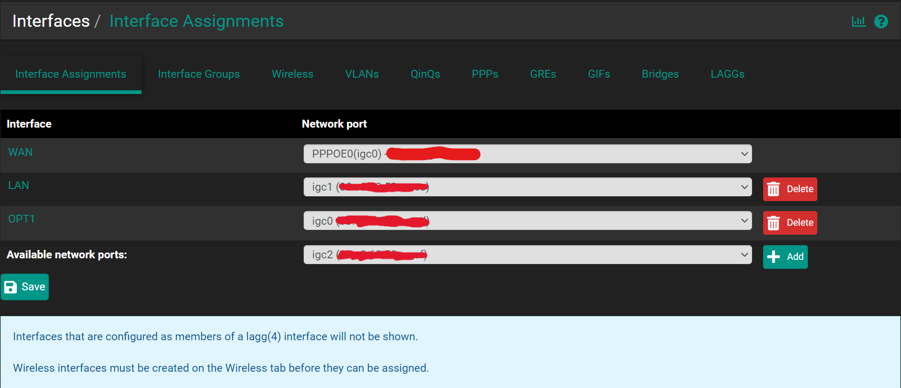

As you have noticed, after setting your `WAN` interface to `PPPoE`, you don't have access to your modem/router webUI.

We have to add an interface and enable outbound NAT for that interface.
Let's fix that.

Navigate to `Interfaces` -> `Assignments`

## Interface

If your `WAN` interface has selected `Network port`: `PPPOE0(igc0)`.

- Select next to `Available network ports` the `igc0`
- Click <kbd>➕Add</kbd>
- Click <kbd>💾Save</kbd>
- Click on the newly created interface

- Description: Give it a meaningful name (eg. `ModemAccess`)
- IPv4 Configuration Type: `Static IPv4`
- IPv4 Address: Use an IP from the modem/router of your ISP (eg. `192.168.1.150` / `24`)
- Uncheck `Block private networks and loopback addresses`
- Uncheck `Block bogon networks`
- Click <kbd>💾Save</kbd>

## NAT

Navigate to `Firewall` -> `NAT` -> `Outbound`

- Select `Hybrid`
- Click <kbd>💾Save</kbd>
- Click <kbd>⤵️Add</kbd>
- Interface: `MODEMACCESS` (or the name you gave before)
- Source:
  - Type: `Network`
  - Network: Your LAN's network address (eg. `10.1.1.0` / `24`)
- Destination:
  - Type: `Network`
  - Network: Your modem/router network address (eg. `192.168.1.0` / `24`)
- Translation Address: `Interface Address`
- Click <kbd>💾Save</kbd>
- Click <kbd>✔️Apply Changes</kbd>

You should now have access to your modem/router webUI!
