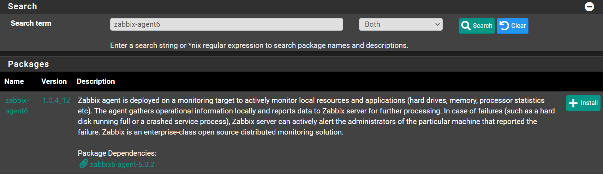

Navigate to `System` -> `Package Manager` -> `Available Packages`

Search for `zabbix-agent6` and click <kbd>➕Install</kbd>



Click <kbd>✔️Confirm</kbd>

Wait until you see `Success`

```shell
>>> Installing pfSense-pkg-zabbix-agent6...
Updating pfSense-core repository catalogue...
pfSense-core repository is up to date.
Updating pfSense repository catalogue...
pfSense repository is up to date.
All repositories are up to date.
The following 2 package(s) will be affected (of 0 checked):

New packages to be INSTALLED:
  pfSense-pkg-zabbix-agent6: 1.0.4_12 [pfSense]
  zabbix6-agent: 6.0.2 [pfSense]

Number of packages to be installed: 2

The process will require 1 MiB more space.
287 KiB to be downloaded.
[1/2] Fetching pfSense-pkg-zabbix-agent6-1.0.4_12.pkg: .. done
[2/2] Fetching zabbix6-agent-6.0.2.pkg: .......... done
Checking integrity... done (0 conflicting)
[1/2] Installing zabbix6-agent-6.0.2...
===> Creating groups.
Creating group 'zabbix' with gid '122'.
===> Creating users
Creating user 'zabbix' with uid '122'.
[1/2] Extracting zabbix6-agent-6.0.2: ......... done
[2/2] Installing pfSense-pkg-zabbix-agent6-1.0.4_12...
[2/2] Extracting pfSense-pkg-zabbix-agent6-1.0.4_12: ........ done
Saving updated package information...
done.
Loading package configuration... done.
Configuring package components...
Loading package instructions...
Custom commands...
Executing custom_php_install_command()...done.
Executing custom_php_resync_config_command()...done.
Menu items... done.
Services... done.
Writing configuration... done.
>>> Cleaning up cache... done.
Success
```
