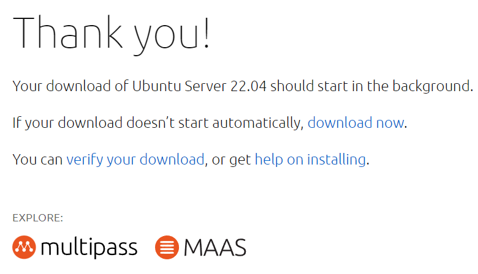

## Download the ISO

- Visit Ubuntu's web [page](https://ubuntu.com/download/server)
- Select `Option 2 - Manual server installation`
- Click <kbd>Download Ubuntu Server 22.04 LTS</kbd>
  
- Right click `download now` under `Thank you` and click `Copy link address`
  
