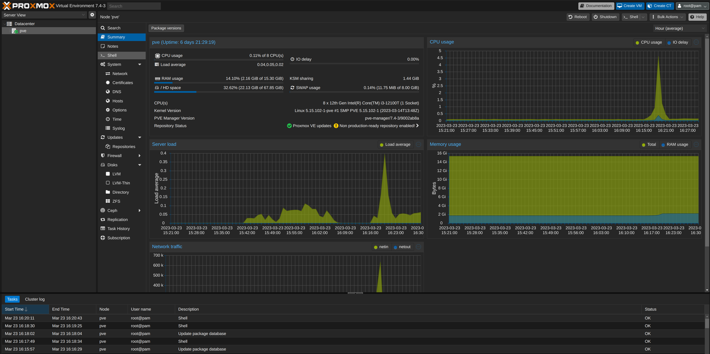
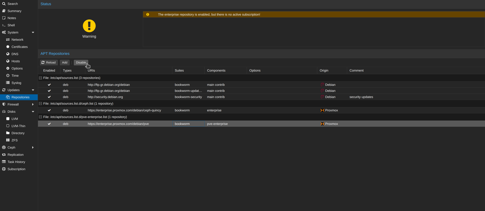
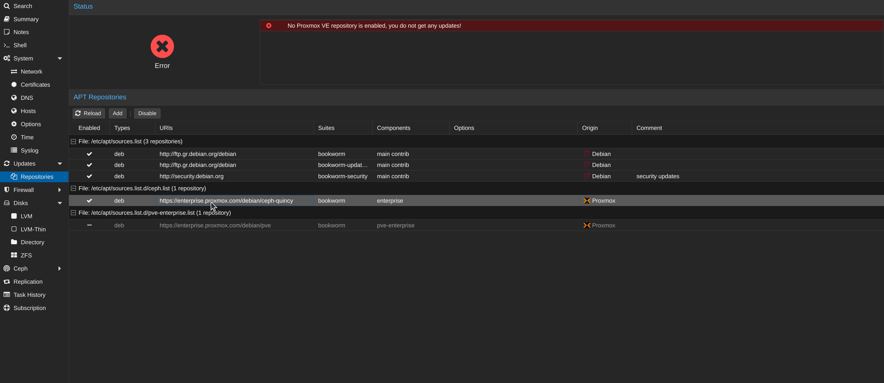
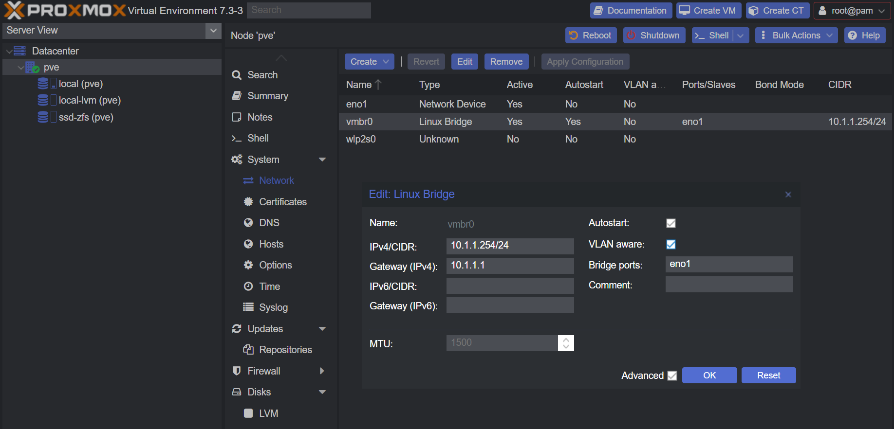
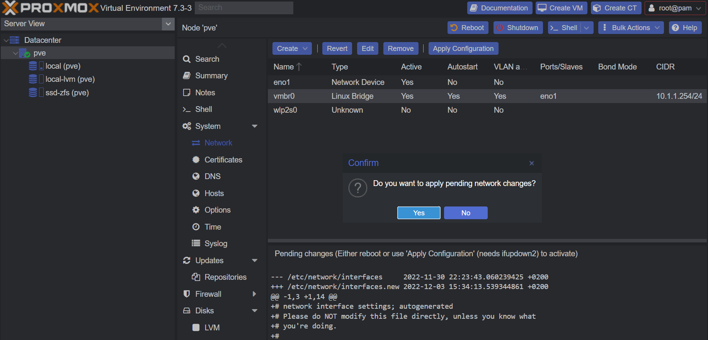
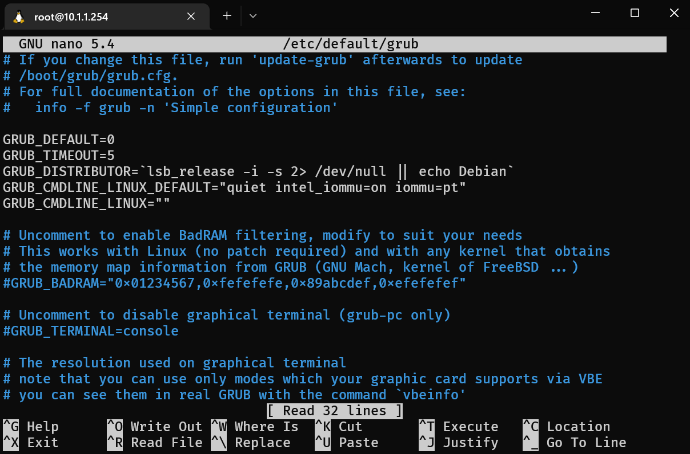
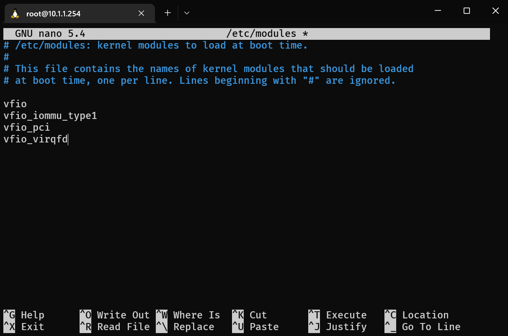

## Dark Theme

- Login to `Proxmox` webUI.
- Select your user name on the top right
- Click `Color Theme`
- Enjoy your dark theme
  

## Remove Enterprise repository

:::danger

This disables enterprise update repository,
if you have an enterprise license, do **NOT** follow the next steps

:::

- Navigate to `Node` -> `Updates` -> `Repositories`
- Select `pve-enterprise` (Look on the `Components` column)
  This is the repository for Proxmox itself
- Click <kbd>Disable</kbd>
  
- Select `enterprise` (Look on the `Components` column)
  This is the repository for Ceph
- Click <kbd>Disable</kbd>
  

## VLAN Aware

You can make `Proxmox` NIC(s) VLAN Aware.

Navigate under your `Node` -> `System` -> `Network`

- Select your NIC
- Click <kbd>Edit</kbd>
- Check `VLAN Aware`
- Click <kbd>OK</kbd>
- Click <kbd>Apply Configuration</kbd>
- Click <kbd>Yes</kbd>
  
  

## Enable IOMMU

SSH into the `Proxmox` Server.

### Adjust GRUB

```shell
nano /etc/default/grub
```

- Edit `GRUB_CMDLINE_LINUX_DEFAULT` line
  - Intel: `GRUB_CMDLINE_LINUX_DEFAULT="quiet intel_iommu=on iommu=pt"`
  - AMD: `GRUB_CMDLINE_LINUX_DEFAULT="quiet amd_iommu=on iommu=pt"`
- Press <kbd>CTRL</kbd> + <kbd>S</kbd> to save
- Press <kbd>CTRL</kbd> + <kbd>X</kbd> to exit
  
- Update grub

  ```shell
  update-grub
  ```

  Example output:

  ```shell
  root@pve:~# update-grub
  Generating grub configuration file ...
  Found linux image: /boot/vmlinuz-5.15.74-1-pve
  Found initrd image: /boot/initrd.img-5.15.74-1-pve
  Found memtest86+ image: /boot/memtest86+.bin
  Found memtest86+ multiboot image: /boot/memtest86+_multiboot.bin
  Warning: os-prober will not be executed to detect other bootable partitions.
  Systems on them will not be added to the GRUB boot configuration.
  Check GRUB_DISABLE_OS_PROBER documentation entry.
  Adding boot menu entry for UEFI Firmware Settings ...
  done
  ```

### Add the required modules

```shell
nano /etc/modules
```

- Add the following

  ```shell
  vfio
  vfio_iommu_type1
  vfio_pci
  vfio_virqfd
  ```

  

- Press <kbd>CTRL</kbd> + <kbd>S</kbd> to save
- Press <kbd>CTRL</kbd> + <kbd>X</kbd> to exit
- Update `initramfs`

  ```shell
  update-initramfs -u -k all
  ```

  Example output:

  ```shell
  root@pve:~# update-initramfs -u -k all
  update-initramfs: Generating /boot/initrd.img-5.15.74-1-pve
  Running hook script 'zz-proxmox-boot'..
  Re-executing '/etc/kernel/postinst.d/zz-proxmox-boot' in new private mount namespace..
  No /etc/kernel/proxmox-boot-uuids found, skipping ESP sync.
  ```

Once you are done with the above, `Reboot`

Verify that `IOMMU` is enabled

- SSH to the server
- Run the following

```shell
dmesg | grep -e DMAR -e IOMMU
```

Example output:

```shell
root@pve:~# dmesg | grep -e DMAR -e IOMMU
[    0.006713] ACPI: DMAR 0x0000000040DD7000 000088 (v02 LENOVO TC-M43   00001180      01000013)
[    0.006749] ACPI: Reserving DMAR table memory at [mem 0x40dd7000-0x40dd7087]
[    0.026685] DMAR: IOMMU enabled
[    0.076308] DMAR: Host address width 39
[    0.076309] DMAR: DRHD base: 0x000000fed90000 flags: 0x0
[    0.076313] DMAR: dmar0: reg_base_addr fed90000 ver 4:0 cap 1c0000c40660462 ecap 29a00f0505e
[    0.076314] DMAR: DRHD base: 0x000000fed91000 flags: 0x1
[    0.076316] DMAR: dmar1: reg_base_addr fed91000 ver 5:0 cap d2008c40660462 ecap f050da
[    0.076319] DMAR: RMRR base: 0x0000004b000000 end: 0x0000004f7fffff
[    0.076321] DMAR-IR: IOAPIC id 2 under DRHD base  0xfed91000 IOMMU 1
[    0.076322] DMAR-IR: HPET id 0 under DRHD base 0xfed91000
[    0.076322] DMAR-IR: Queued invalidation will be enabled to support x2apic and Intr-remapping.
[    0.077930] DMAR-IR: Enabled IRQ remapping in x2apic mode
[    0.261416] pci 0000:00:02.0: DMAR: Skip IOMMU disabling for graphics
[    0.328045] DMAR: No ATSR found
[    0.328045] DMAR: No SATC found
[    0.328046] DMAR: IOMMU feature fl1gp_support inconsistent
[    0.328047] DMAR: IOMMU feature pgsel_inv inconsistent
[    0.328048] DMAR: IOMMU feature nwfs inconsistent
[    0.328048] DMAR: IOMMU feature dit inconsistent
[    0.328048] DMAR: IOMMU feature sc_support inconsistent
[    0.328049] DMAR: IOMMU feature dev_iotlb_support inconsistent
[    0.328049] DMAR: dmar0: Using Queued invalidation
[    0.328052] DMAR: dmar1: Using Queued invalidation
[    0.328913] DMAR: Intel(R) Virtualization Technology for Directed I/O
```

You want to see `DMAR: IOMMU enabled`.
