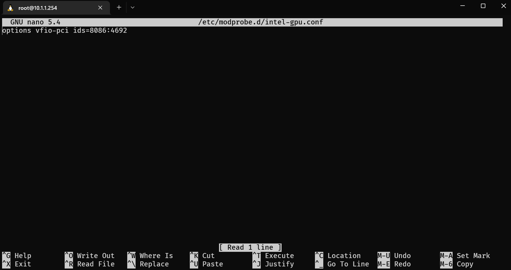
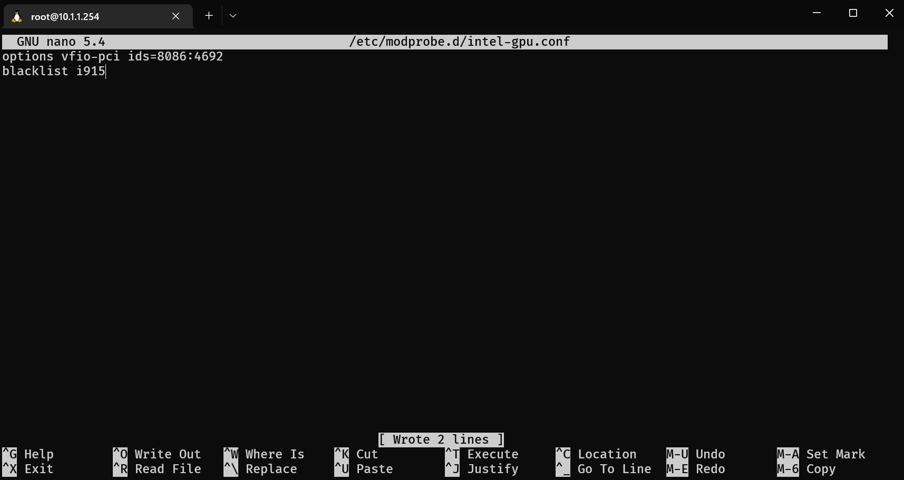

## iGPU as Host Device Passthrough

This will pass the whole iGPU to a single VM.
This is useful if you want that VM to pass slices of iGPU to docker containers for example.

> Tested on a `Lenovo M70q Gen3`

- SSH into the `Proxmox` server.

  ```shell
  lspci -nn | grep VGA
  ```

  Example output:

  ```shell
  root@pve:~# lspci -nn | grep VGA
  00:02.0 VGA compatible controller [0300]: Intel Corporation Device [8086:4692] (rev 0c)
  ```

- Grab the ID, for me it was `8086:4692`.
- Add the ID into a `.conf` file in `/etc/modprobe.d`

  ```shell
  nano /etc/modprobe.d/intel-gpu.conf
  ```

  Paste:

  ```shell
  options vfio-pci ids=8086:4692
  ```

  

- Press <kbd>CTRL</kbd> + <kbd>S</kbd> to save
- Press <kbd>CTRL</kbd> + <kbd>X</kbd> to exit
- Get GPU driver name

  ```shell
  lspci -nnk | grep VGA -A5
  ```

  Example output:

  ```shell
  root@pve:~# lspci -nnk | grep VGA -A5
  00:02.0 VGA compatible controller [0300]: Intel Corporation Device [8086:4692] (rev 0c)
          DeviceName: Onboard - Video
          Subsystem: Lenovo Device [17aa:330b]
          Kernel driver in use: i915
          Kernel modules: i915
  ```

- Grab driver, for me it was `i915`
- Blacklist driver

  ```shell
  nano /etc/modprobe.d/intel-gpu.conf
  ```

  Paste:

  ```shell
  blacklist i915
  ```

  

- Press <kbd>CTRL</kbd> + <kbd>S</kbd> to save
- Press <kbd>CTRL</kbd> + <kbd>X</kbd> to exit
- Update `initramfs`

  ```shell
  update-initramfs -u -k all
  ```

  Example output:

  ```shell
  root@pve:~# update-initramfs -u -k all
  update-initramfs: Generating /boot/initrd.img-5.15.74-1-pve
  Running hook script 'zz-proxmox-boot'..
  Re-executing '/etc/kernel/postinst.d/zz-proxmox-boot' in new private mount namespace..
  No /etc/kernel/proxmox-boot-uuids found, skipping ESP sync.
  ```

Once you are done with the above, `Reboot`

## iGPU with SR-IOV

It needs at least kernel 5.19 and a modified [driver](https://github.com/strongtz/i915-sriov-dkms)
I'll be waiting for it to hit mainline kernel. Tracking this [issue](https://github.com/intel/linux-intel-lts/issues/33)
