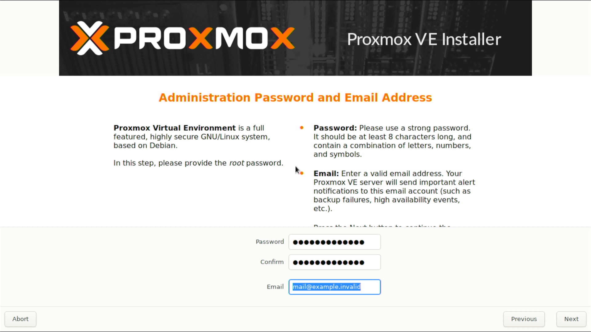

:::note

Prerequisite to have a boot-able USB with Proxmox ready.

:::

Boot the USB drive you [prepared](prepare.md) and once you reach the Proxmox Installer follow the steps

- License Agreement
  - Click `I agree`
    
- Password and Email
  - `Password`: Enter a password
  - `Confirm`: Enter a password
  - `Email`: Enter your mail
    
- Installation Disk
  - Select the disk you will install Proxmox
    
- Network
  - Select the management interface
  - Enter a hostname, for example `pve.localdomain`
  - Enter IP address for Proxmox, for example `10.1.1.254`
  - Enter Gateway
  - Enter DNS Server
    
- Finish
  - Click `Reboot`
    
- Boot complete
  - Copy the address
    
- Visit WebUI
  - Open `https://10.1.1.254:8006`
    
- Login
  - Username: `root`
  - Password: The password you entered during setup

You have successfully installed `Proxmox`.
