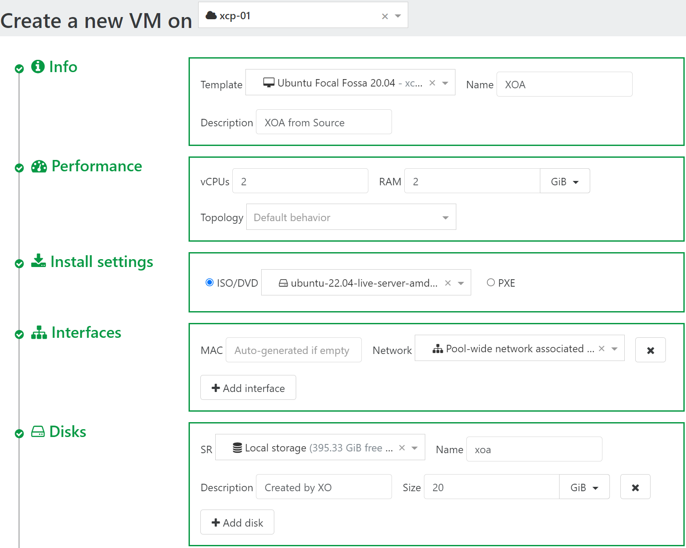
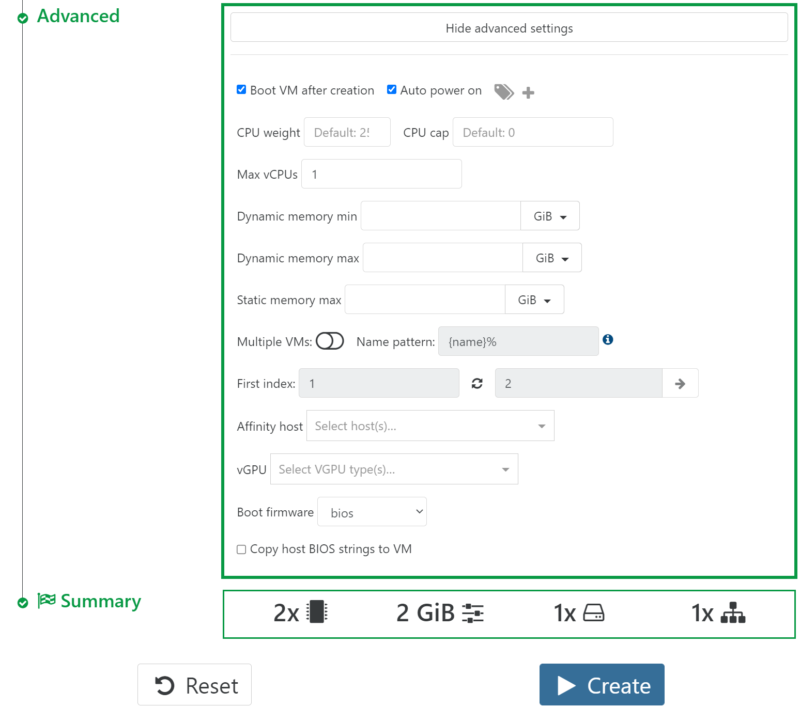

In this example we will use Ubuntu 22.04 as the OS for our VM.

:::info[Prerequisites]

- [ISO storage created](./create-iso-storage#create-iso-storage-in-xoa)
- [ISO downloaded](./create-iso-storage#download-iso)

:::

## Create VM

Navigate to `➕New` > `🖥️VMs`

- Click <kbd>New VM</kbd>
- On the top select a pool
- **Info**
  - Template: `Ubuntu Focal Fossa 20.04`
  - Name: `XOA` (Give a name for your VM)
  - Description: `XOA from Source` (Give a Description for your VM)
- **Performance**
  - vCPUs: `2`
  - RAM: `2`
- **Install settings**
  - ISO/DVD: Select `ubuntu-22.04-live-server-amd64.iso`
- **Disks**
  - Name: `xoa` (Give a name for your disk)
  - Size: `20GiB`
- **Advanced**
- Click <kbd>Show Advanced Settings</kbd>
- Check `Auto power on`
- Click <kbd>▶️Create</kbd>

  
  

## Install OS to VM

Navigate to `🏠Home` > `🖥️VMs`

- Click `XOA` VM (with descriptions `XOA from Source`)
- Navigate to `Console`
- Follow the on-screen instructions to install `Ubuntu`
